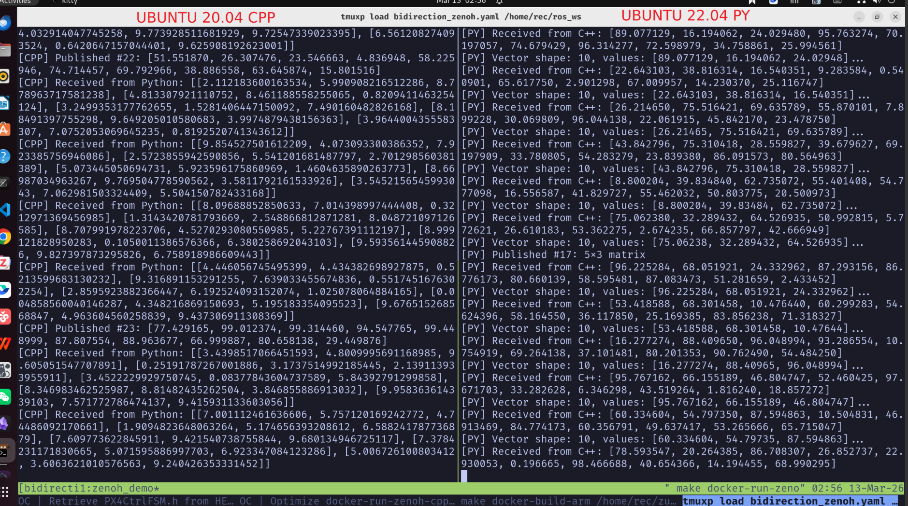

# Zenoh Bidirectional Communication



## Overview

Bidirectional communication bridge between Ubuntu 20.04 (C++) and Ubuntu 22.04 (Python) using Eclipse Zenoh.

## Features

- **Lightweight**: Minimal overhead, suitable for resource-constrained embedded systems
- **Cross-Platform**: Works seamlessly across different Ubuntu versions and architectures
- **Pub-Sub Pattern**: Flexible publish-subscribe messaging for decoupled communication
- **Low Latency**: Optimized for real-time data streaming
- **Language Agnostic**: Native support for C++, Python, Rust, and more

### Lightweight Evidence

Docker image sizes compared to typical robotics/simulation images:

```bash
$ docker image ls | grep zenoh
docker-run-zenoh-cpp:latest      86.3MB
docker-run-zenoh-py:latest       167MB
```

Comparison with other common robotics images:

| Image | Size |
|-------|------|
| docker-run-zenoh-cpp | **86.3MB** |
| docker-run-zenoh-py | **167MB** |
| px4-sim-v1.14.0 | 7.48GB |
| isaaclab_image:v0 | 27.1GB |
| nvcr.io/nvidia/isaac/ros:x86_64-ros2_humble | 40GB |

## Problem Statement

Solves the communication gap between:

| Component | Environment | Language |
|-----------|-------------|----------|
| Jetpack ROS1 px4ctrl | Ubuntu 20.04 | C++ |
| Inference Service | Ubuntu 22.04 | Python |

Traditional ROS1 communication requires matching ROS versions across nodes, creating deployment challenges when inference services need newer Python environments (22.04) while flight controllers remain on Jetpack/ROS1 (20.04).

## Solution Architecture

Zenoh acts as a middleware layer enabling:

1. **C++ Publisher/Subscriber** (Ubuntu 20.04) - Flight control commands, sensor data, state machine.
2. **Python Bridge** (Ubuntu 22.04) - ML inference results, high-level commands

```
┌─────────────────────┐       Zenoh       ┌─────────────────────┐
│   Ubuntu 20.04      │    (TCP/UDP)      │   Ubuntu 22.04      │
│  ┌───────────────┐  │◄───────────────►│  ┌───────────────┐  │
│  │  C++ Zenoh    │  │                  │  │  Python Zenoh │  │
│  │  ROS1 px4ctrl │  │                  │  │  Inference    │  │
│  └───────────────┘  │                  │  └───────────────┘  │
└─────────────────────┘                  └─────────────────────┘
```

## Proof of Working Bridge

Successfully tested bidirectional communication between Ubuntu 20.04 (C++) and Ubuntu 22.04 (Python):


The screenshot demonstrates:
- C++ publisher/subscriber running on Ubuntu 20.04
- Python bridge running on Ubuntu 22.04
- Real-time message exchange between both endpoints

## Technical Details

### Prerequisites

- Docker (for isolated environments)
- Zenoh router (optional for multi-host setups)

### Quick Start

```bash
# Using tmux session
make docker-run-zenoh-cpp   # C++ side (20.04)
make docker-run-zenoh-py    # Python side (22.04)
```

### Key Configuration

- Session: `bidirection_zenoh`
- Protocol: TCP/UDP with automatic discovery
- QoS: Configurable reliability levels

### Message Flow

1. C++ node publishes sensor/telemetry data
2. Python subscriber receives and processes through inference pipeline
3. Python publisher sends control commands back
4. C++ subscriber executes commands on px4ctrl

## References

- [Eclipse Zenoh Documentation](https://zenoh.io/docs/overview/)
- Repository: [https://github.com/WarriorHanamy/ros_ws](https://github.com/WarriorHanamy/ros_ws)
- Commit: `880e73d95898ceee34f456ca466663a33420bea2`
